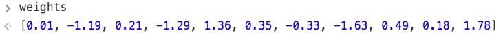
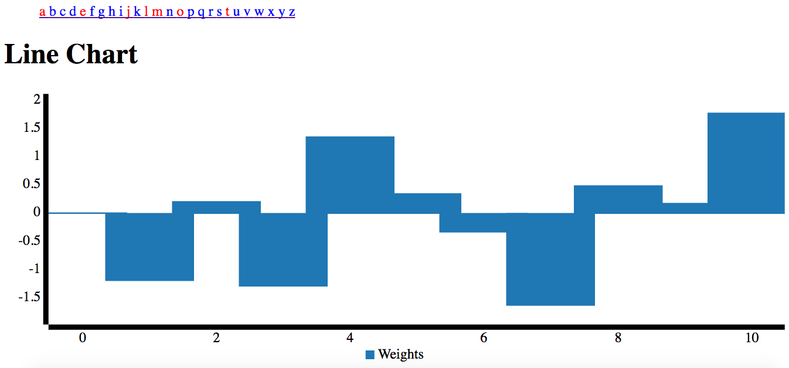

## Perceptron Learning

A perceptron is the simplest form of 'neural network' learning. 

The 'neuron' is simply a vector that can be multiplied against data points to say 1 or 0. 



Learning consists of exposing the perceptron to data, and if it's wrong, adjusting the vector in the other direction. 

This app uses core python's hash function to convert characters into 11 digit numbers, which are then the learning space for the perceptron's 11-weight model.

At the moment you get a VowelPerceptron `vp` just for importing the module `voweler`:

```
In [8]: voweler.vp.to_vec('h')
Out[8]: array([1, 3, 3, 1, 2, 0, 4, 0, 0, 4, 1])
```

Each page load gets predictions (red vowel, blue consonant) for the full alphabet from the current perceptron state, as well as a graph of that state.

Run yourself to click a letter and teach the perceptron! (Only errors count)



## To run

Requires numpy and Flask

Simply:

```
$ python wsgi.py 
 * Running on http://0.0.0.0:5000/ (Press CTRL+C to quit)
 * Restarting with stat
 * Debugger is active!
 * Debugger pin code: 154-709-709

```

and it should work! (TODO: 5000 is hardcoded in template)


